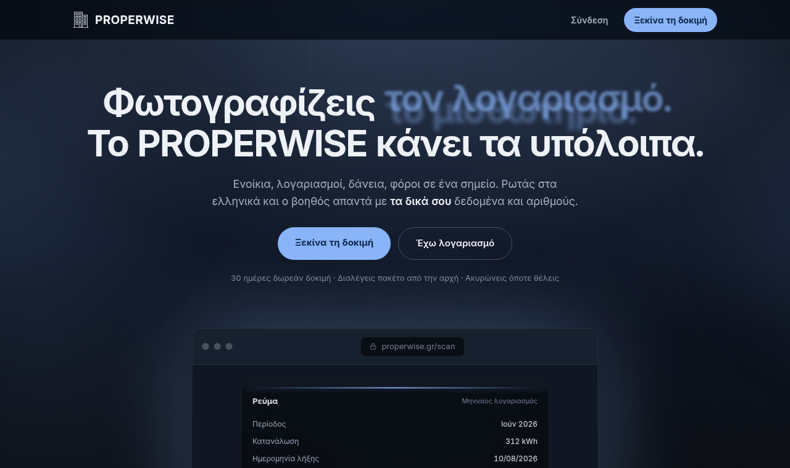
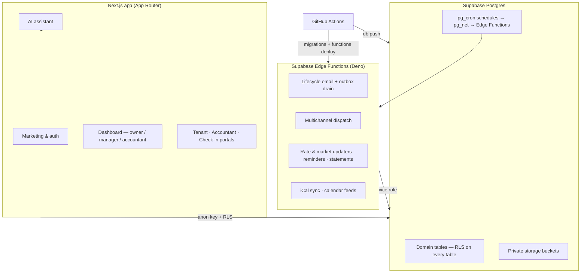

<div align="center">

<picture>
  <source media="(prefers-color-scheme: dark)" srcset="public/brand/properwise-logotypo-lefko.png">
  
</picture>

### The operating system for Greek property owners and managers

_Το ακίνητό σου, υπό έλεγχο._

[](https://properwise.gr)
&nbsp;
&nbsp;
&nbsp;
&nbsp;

<br/>



</div>

PROPERWISE turns the scattered, paperwork-heavy reality of owning and managing
property in Greece — bills, tenants, taxes, loans, short-stay pricing, compliance —
into a single, calm, real-time console. It is built for three audiences from one
codebase: **individual owners**, **professional managers**, and **the accountants who
serve them**.

> This repository is **private**. It contains proprietary product code and
> infrastructure for a production service handling customer data. A curated public
> showcase of the product lives at **[properwise.gr](https://properwise.gr)**.

---

## Table of contents

- [What it does](#what-it-does)
- [Built to a bar](#built-to-a-bar)
- [Tech stack](#tech-stack)
- [Architecture](#architecture)
- [Repository layout](#repository-layout)
- [Database & security](#database--security)
- [Local development](#local-development)
- [Quality gates](#quality-gates)
- [CI/CD & deployment](#cicd--deployment)
- [Documentation](#documentation)

---

## What it does

| Domain | Capability |
|---|---|
| **Bills & energy** | Every electricity/gas/water/internet provider and tariff in Greece, per-property; reads real market prices and flags savings. |
| **Tenants & leases** | Lease ledger (base rent + service charges), monthly statements, rent receipts / βεβαίωση ενοικίου, dunning, a tenant portal with PIN gate and payment requests (IBAN/QR). |
| **Accounting & tax** | Greek tax engine (income scales, ΕΝΦΙΑ, ΕΦΚΑ, advance tax, depreciation, transfer costs), Ε2/Ε1 filing bundle, period locking with audit trail, bank-statement import & auto-match. |
| **Loans** | «Σπίτι μου ΙΙ» eligibility, best-loan recommender, amortization, live bank-rate data, and an assistant that coaches the whole journey. |
| **Short-stay** | Dynamic pricing engine, iCal sync (Airbnb/Booking), occupancy & yield projections, season recap. |
| **CRM** | Client/guest relationship model with stay history, notes timeline, rating/tags — for brokers and managers. |
| **Reporting** | Branded investor/accountant PDF reports with charts, cross-property comparison, universal Excel/CSV export. |
| **Lifecycle comms** | A value-first email & multichannel (push/Viber/WhatsApp/iMessage) engine with a cadence/anti-spam policy — an internal tool the management team uses to keep each user informed. |
| **Referrals & billing** | Persona-split referral economics, plan entitlements, organizations & team permissions. |

An in-app AI assistant is trained on the domain and can explain, inform, register,
and advise across all of the above.

## Built to a bar

The product is held to a level normally reserved for much larger teams, and the bar is
**enforced in code** rather than left to discipline:

- **Executable guardrails.** 130+ project-specific guard scripts (`scripts/guard-*.mjs`)
  make whole classes of mistake _impossible to merge_ — RLS coverage, secret-in-bundle
  scans, Greek typography and number formatting, decimal-comma money, accessibility
  invariants, design-token drift, dead code, CI-cost limits. Each guard is itself
  proven by a mutation test, so a guard that no longer catches its bug fails loudly.
- **Tested domain core.** 250+ suites cover the parts where correctness is money —
  Greek tax, ΕΝΦΙΑ, Ε2, amortization, pricing, ledgers, billing, the messaging cadence.
  The `lib/` layer is framework-free on purpose, so business rules are verifiable in
  isolation.
- **Measured, not assumed.** A real-browser **performance budget** ratchets the wire
  weight of every public page (it can only go down without an explicit, documented
  raise); device- and engine-level scanners check layout, overflow, tap targets and
  alignment across phones and tablets.
- **Security by construction.** Row-Level Security on every table, a strict
  Content-Security-Policy with per-request nonce + `strict-dynamic` (no `unsafe-inline`
  scripts), signed webhooks with constant-time verification, and no standing write
  credential anywhere.
- **Privacy as a feature.** No advertising cookies, no analytics cookies, no personal
  tracking — only anonymous, cookieless, aggregate traffic measurement, disclosed in
  the privacy policy.

## Tech stack

- **Framework** — [Next.js](https://nextjs.org) 16 (App Router, Turbopack) · React 19 · TypeScript (strict)
- **Styling** — Tailwind CSS v4, a single design-system token layer (`Theme`), self-hosted Inter
- **Backend** — [Supabase](https://supabase.com): Postgres + Row-Level Security, Auth, Storage, Edge Functions (Deno), `pg_cron` + `pg_net`
- **Data/UX** — Recharts (charts), pdfmake (documents), xlsx (exports), qrcode-generator
- **Tooling** — ESLint (`eslint-config-next`), `tsx` test runner, GitHub Actions CI/CD

## Architecture



Two trust boundaries: the **browser** talks to Postgres with the anon key, gated
entirely by Row-Level Security; **edge functions** hold the service-role key and run
the privileged work. No always-on write credential exists anywhere — schema changes
ship as migrations applied by CI.

## Repository layout

```
app/                 Next.js App Router — landing, auth, dashboard, portals, API routes
  dashboard/         The authenticated console (tabs, components, AI assistant)
  portal/ accountant/ checkin/   Token-gated external portals
components/           Shared UI primitives (Theme design system)
lib/                  Domain logic — pure, tested, framework-free
  accounting/ billing/ loans/ pricing/ calendar/ clients/ tax/ documents/ i18n/ …
supabase/
  migrations/        Schema as code — one migration owns each change
  functions/         Edge functions (Deno) + _shared domain modules
docs/                Engineering & product docs (DB, infra, marketing)
scripts/             Executable guardrails, scanners & generators
.github/workflows/   CI/CD — quality gate, Supabase deploy, daily DB backup
```

The `lib/` layer is deliberately framework-free and unit-tested, so business rules
(Greek tax, amortization, pricing, ledgers) are verifiable in isolation.

## Database & security

- **Row-Level Security on every table.** One canonical policy per table
  (`own_<table>` keyed by `user_id`), org policies via a single `is_org_member`
  helper only where team sharing applies. See [`docs/db/rls-conventions.md`](docs/db/rls-conventions.md).
- **Migrations as code.** The entire schema rebuilds from `supabase/migrations/`.
  The deploy pipeline self-reconciles migration history before every push.
- **Least privilege.** Service-role key lives only in edge-function env; the client
  uses the anon key. Cron/`pg_net` calls target only our own functions.
- **Defence in depth & DD readiness** — see
  [`docs/db/security-and-automation.md`](docs/db/security-and-automation.md) and
  [`docs/infra/acquisition-readiness.md`](docs/infra/acquisition-readiness.md).

## Local development

Requires Node 20+.

```bash
npm install
cp .env.example .env.local   # fill in Supabase + provider keys
npm run dev                  # http://localhost:3000
```

> **Note on Next.js:** this project tracks a fast-moving Next.js release. Before
> touching framework-level code, read the bundled guides in
> `node_modules/next/dist/docs/` — see [`AGENTS.md`](AGENTS.md).

## Quality gates

Run the same checks CI does, locally:

```bash
npm run test        # full domain + messaging suite (250+ suites)
npm run guards      # 130+ executable guardrails
npm run lint        # ESLint
npx tsc --noEmit    # strict typecheck
```

The domain suite covers billing, Greek tax, ΕΝΦΙΑ, Ε2, accounting ledgers, calendar,
clients and i18n, plus verifiers for the messaging policy, copy, and gender-safe
rendering. Guards, scanners and the performance budget extend the same discipline to
security, layout and wire weight.

## CI/CD & deployment

GitHub Actions workflows, all driven by short-lived secrets (no standing
credentials):

- **`ci.yml`** — quality gate on every PR to `main` and `claude/**` push: secret
  scan, lint-debt ratchet (error count may only go down), typecheck, the full domain
  test-suite, the guardrails, browser layout/overflow scanners across devices, and a
  real-browser performance budget. Blocking; no deploy.
- **`supabase-deploy.yml`** — on push, reconciles migration history, runs
  `supabase db push`, and deploys the edge functions (staging on `claude/**`,
  production on `main`). Self-healing and idempotent, with a failure-alert job.
- **`db-backup.yml`** — daily logical dump (roles + schema + data) to a private,
  retained artifact — an off-site safety net on the current plan.
- **Dependabot** keeps npm + the Actions current, each update verified by `ci.yml`.

## Documentation

| Doc | Purpose |
|---|---|
| [`supabase/README.md`](supabase/README.md) | Schema reference & ERD |
| [`docs/db/rls-conventions.md`](docs/db/rls-conventions.md) | Row-Level Security model & audit |
| [`docs/db/security-and-automation.md`](docs/db/security-and-automation.md) | Security posture & automation runbook |
| [`docs/db/security-audit-2026-07.md`](docs/db/security-audit-2026-07.md) | Security audit — findings & resolutions |
| [`docs/infra/runbook.md`](docs/infra/runbook.md) | Operations runbook (deploys, secrets, backups, incidents) |
| [`docs/infra/acquisition-readiness.md`](docs/infra/acquisition-readiness.md) | Technical due-diligence checklist |
| [`docs/marketing/world-class-scheme.md`](docs/marketing/world-class-scheme.md) | Lifecycle-comms playbook |

---

<div align="center">

© PROPERWISE. All rights reserved. Proprietary and confidential.

</div>
